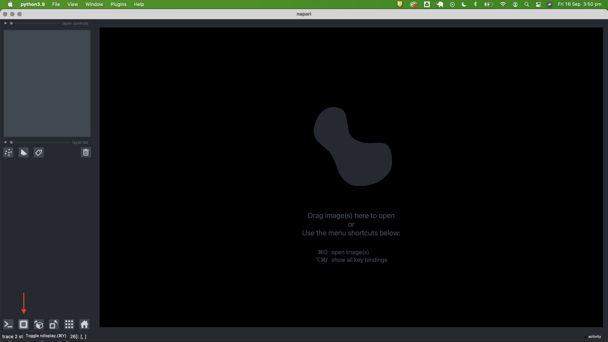
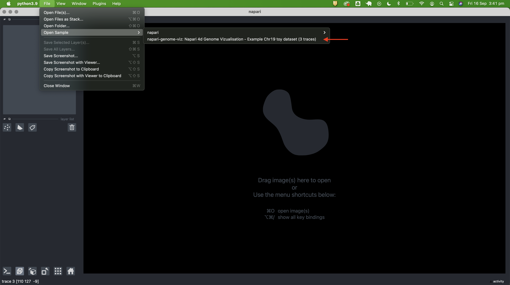
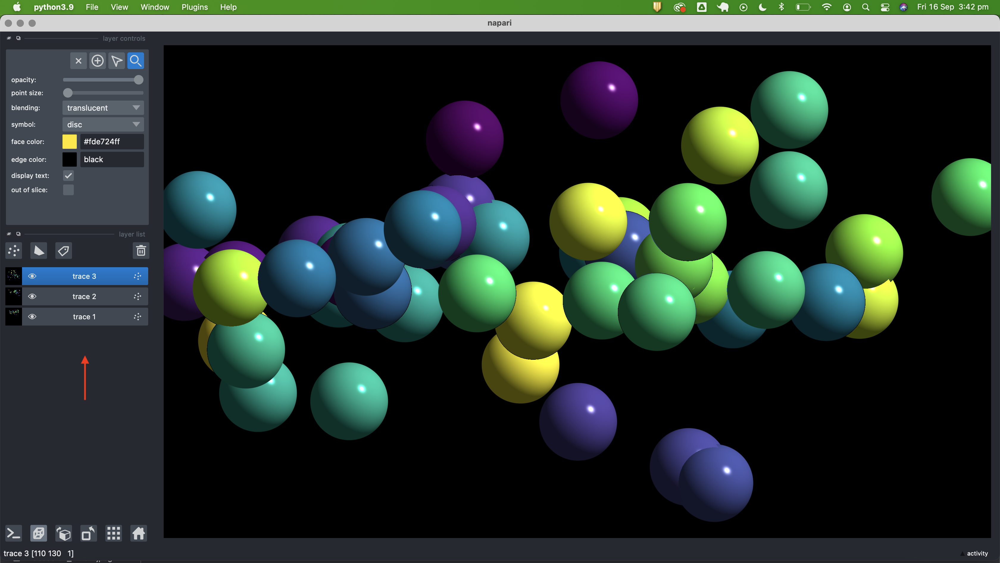
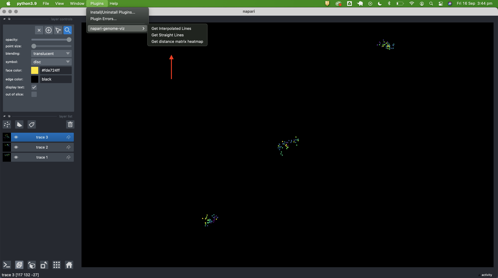
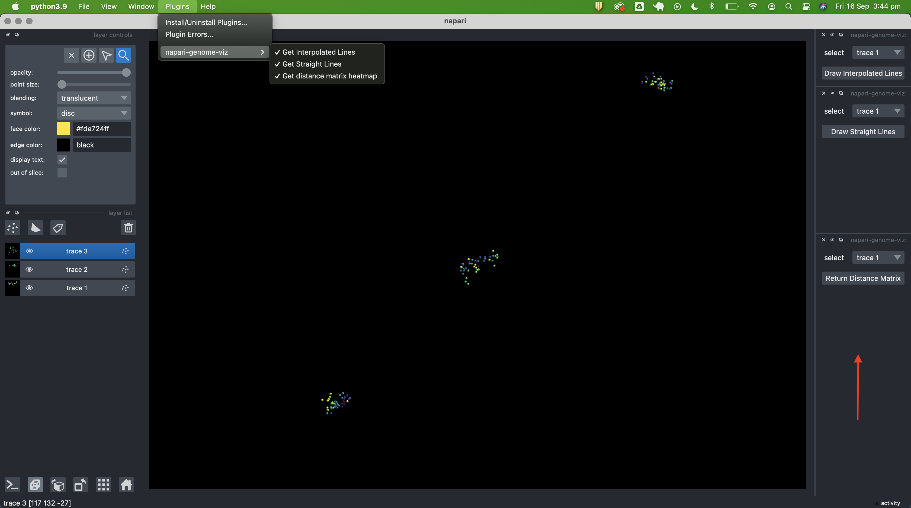
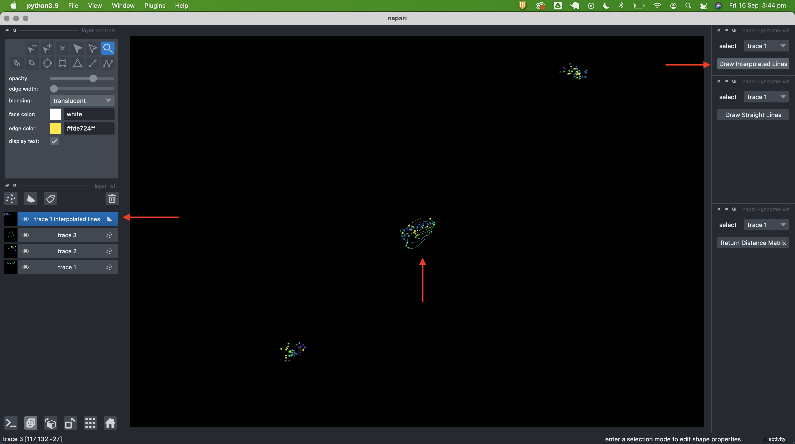
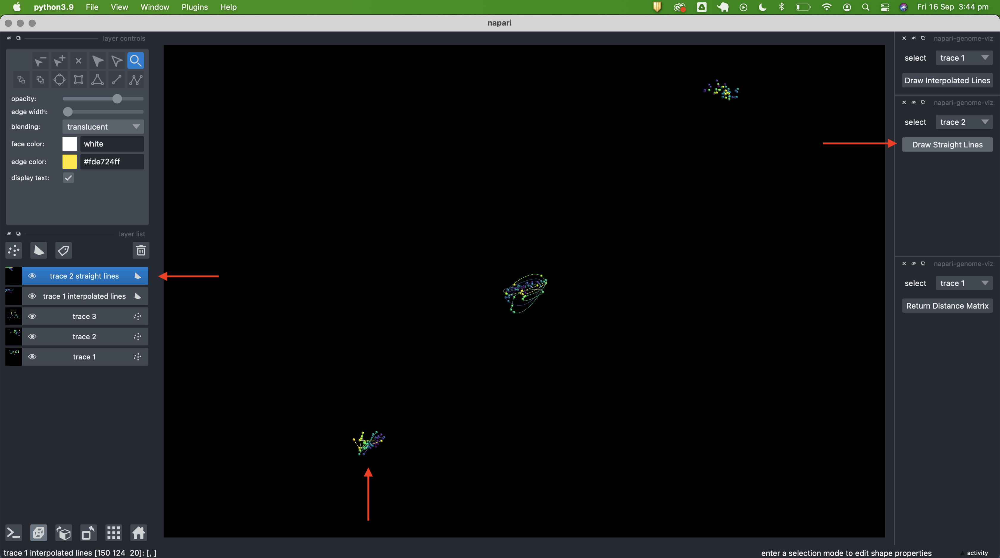
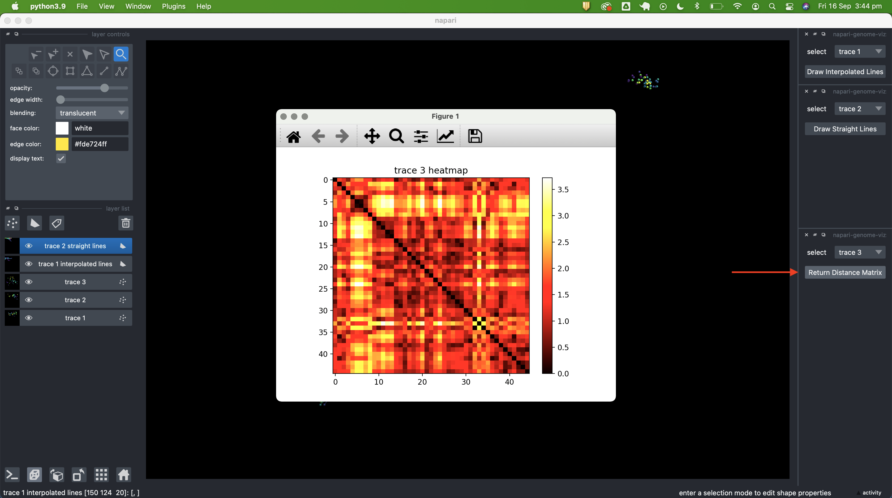

# napari-genome-viz

A plugin to visualise FOF-CT data

----------------------------------

This [napari] plugin was generated with [Cookiecutter] using [@napari]'s [cookiecutter-napari-plugin] template.

## Overview

This plugin allows visualisation of chromatin traces uniformly presented in the 4DN standard FISH-Omics Format - Chromatin Tracing (FOF-CT) (as at https://data.4dnucleome.org/resources/data-collections/chromatin-tracing-datasets)

## Installation

You can install `napari-genome-viz` via [pip]:

    pip install napari-genome-viz

To install latest development version :

    pip install git+https://github.com/RubyDawes/napari-genome-viz.git

## Usage Guide

To demonstrate functionality, this guide will take you through opening the sample data file and utilising all 3 current widgets.

First, click on the n-dimensions button to toggle from 2D (default) to 3D (FOF-CT data is 3-dimensional)

Open the sample image from the menu File > Open samples > napari-genome-viz > Napari 4d Genome Vizualisation - Example Chr19 toy dataset (3 traces), or else open / drag-and-drop your own FOF-CT file, and select the genome viz reader when prompted.

This will populate napari viewer with 3 layers, corresponding to the 3 traces in the sample data file.

Open widgets by selecting the 3 results on the Plugins > napari-genome-viz menu.

The 3 widgets will appear on the RHS of the napari viewer.

To draw cubic interpolated lines for a trace, select trace using dropdown select menu, and then click 'Draw Interpolated Lines'. Lines layer will appear on layers pane.

To draw straight lines for a trace, select trace using dropdown select menu, and then click 'Draw Straight Lines'. Lines layer will appear on layers pane.

To return distance matrix heatmap trace, select trace using dropdown select menu, and then click 'Return Distance Matrix'. MatPlotLib popup window will appear with plotted heatmap.

## To Dos

### Additional functionality

1. Currently the reader isn't checking for missing coordinates in the traces. Add a check for the target regions (e.g. https://data.4dnucleome.org/experiment-set-replicates/4DNESXYFBZMI/#supplementary-files target regions bed file), and adjust colour spectrum accordingly. Then, for individual distance matrix heatmaps, make sure missing points in the trace are represented by grey rows, so every heatmap has the same number of rows and columns.

2. Widgets currently plot lines / heatmap for a single trace at the time. Add functionality to allow selection of multiple traces / all traces at once for plotting lines / avverage heatmaps across all traces.

3. Current functionality and test data is limited to a single chromosome (chr19) in different cells, and each chromosome trace is coloured in a spectrum, which is the same for each individual chromosome.  For future datasets which include traces of multiple distinct chromosomes in the same cell, add the option to colour different chromosomes differently. In addition colour type 1 / type 2 in different colour schemes.

4. Additional reader(s) to add co-immonufluorescence or cell bounday labeling on top of chromosome trace coordinates.

5. Add writer function to save images of traces. I've kept the template writer file (src/napari_genome_viz/_writer.py as a starting point).

### Cosmetic/UI related

a. Make the reader open the trace data in 3D view by default

b. Deactivate/hide inactive layer controls panel once trace data is loaded

c. Add the option to center rotation controls around selected trace/cell

d. Right now 3d interpolation is done 'manually' by calculating line segments between points.  There may be a napari layer type which could be adapted do this more effectively/quickly - e.g. 3d paths, tracks. Otherwise, a new napari layer type could be created.

## License

Distributed under the terms of the [BSD-3] license,
"napari-genome-viz" is free and open source software

## Issues

If you encounter any problems, please [file an issue] along with a detailed description.

[napari]: https://github.com/napari/napari
[Cookiecutter]: https://github.com/audreyr/cookiecutter
[@napari]: https://github.com/napari
[MIT]: http://opensource.org/licenses/MIT
[BSD-3]: http://opensource.org/licenses/BSD-3-Clause
[GNU GPL v3.0]: http://www.gnu.org/licenses/gpl-3.0.txt
[GNU LGPL v3.0]: http://www.gnu.org/licenses/lgpl-3.0.txt
[Apache Software License 2.0]: http://www.apache.org/licenses/LICENSE-2.0
[Mozilla Public License 2.0]: https://www.mozilla.org/media/MPL/2.0/index.txt
[cookiecutter-napari-plugin]: https://github.com/napari/cookiecutter-napari-plugin

[file an issue]: https://github.com/RubyDawes/napari-genome-viz/issues

[napari]: https://github.com/napari/napari
[tox]: https://tox.readthedocs.io/en/latest/
[pip]: https://pypi.org/project/pip/
[PyPI]: https://pypi.org/
